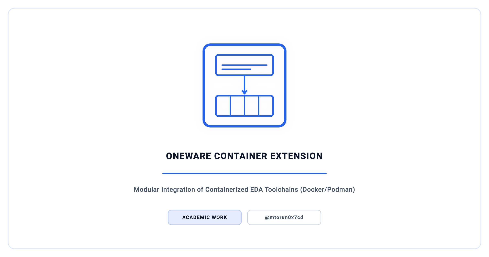
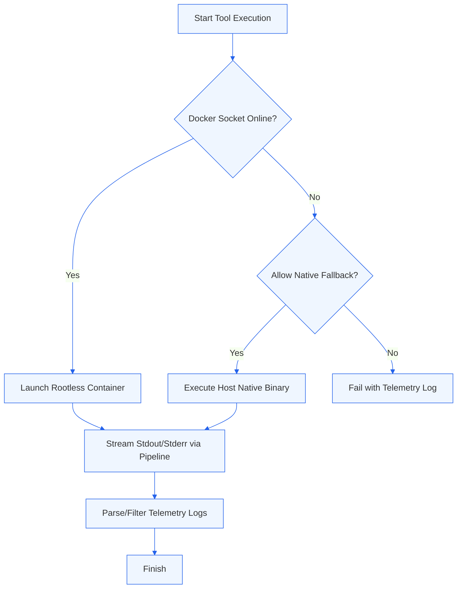

<p align="center">
  <picture>
    <source media="(prefers-color-scheme: dark)" srcset="docs/social_preview_dark.png" />
    <source media="(prefers-color-scheme: light)" srcset="docs/social_preview_light.png" />
    
  </picture>
</p>

# OneWare Container Extension

> A modular, reflection-free, and Native-AOT compatible .NET 10 plug-in architecture for OneWare Studio, providing transparent, rootless containerized execution of heterogeneous open-source EDA toolchains (GHDL, Icarus, Verilator, Yosys, nextpnr) with dynamic native fallback capabilities.


---

## Overview

This project implements a modular container extension architecture for OneWare Studio, an extensible development environment for digital design and hardware verification. The extension enables developers to execute complex, heterogeneous EDA toolchains (e.g., GHDL for VHDL simulation, Icarus Verilog, Verilator, Yosys, and nextpnr) inside isolated, rootless container environments. By standardizing execution contexts, the architecture eliminates "Environment Drift" across developer machines and build systems, and constrains tool execution within a hardened, rootless container sandbox as a defence-in-depth measure.

The plugin core is built with C# and targets .NET 10 with `IsAotCompatible` constraints, using compile-time source generators for JSON serialization (`JsonSerializerContext`), configuration validation, and regular expressions. Container `stdout`/`stderr` is demultiplexed incrementally via the Docker multiplexed attach stream into pooled (`ArrayPool`) buffers, and telemetry drains through a `System.Threading.Channels` channel, avoiding large object heap (LOH) fragmentation. Container routing is opt-in per tool through the **Hybrid Strategy Pattern**; when a container runtime is unavailable and native fallback is enabled, the engine falls back to native binary execution.

## Context

| Dimension | Detail |
| :--- | :--- |
| **Institution** | TH Köln (University of Applied Sciences) |
| **Program** | Computer Science & Engineering (Technische Informatik) (M.Sc.) |
| **Course** | Master's Thesis |
| **Semester** | Summer Semester 2026 |
| **Type** | Individual project |
| **ePublications** | Thesis to be archived in TH Köln's [institutional repository](https://epb.bibl.th-koeln.de/); persistent URN/DOI added once assigned |

## Features

- **Hybrid Strategy Pattern** — Registers a container execution strategy that OneWare dispatches to per tool (opt-in; native execution is the default). When the runtime is unavailable and native fallback is explicitly enabled, it falls back to the host `PATH` binary; otherwise it fails with a diagnostic.
- **Rootless, Non-Privileged Containers** — Injects the host UID/GID via `--user` on rootful runtimes so tool outputs are not root-owned (on rootless runtimes the image's non-root `oneware` user applies instead), and drops all Linux capabilities with `no-new-privileges` and a PID-count cap.
- **AOT-Compatible, Source-Generated Design** — Targets `IsAotCompatible` .NET 10 using source-generated JSON serialisation, settings validation, and regular expressions.
- **PID 1 Signal Management** — Integrates `tini` as the container init process to handle zombie process reaping and forward operating system signals cleanly.
- **Vectorised Character Scanning** — Uses `SearchValues<char>`, which the .NET runtime lowers to vectorised search where the hardware supports it, for hot-path character classification; container-name validation uses a source-generated, non-backtracking regex.
- **Streamed Log Parsing** — Demultiplexes container `stdout`/`stderr` via the Docker multiplexed attach stream into pooled (`ArrayPool`) buffers and drains telemetry through a `System.Threading.Channels` channel.
- **Structured Telemetry** — Source-generated JSON serialisation (pre-compiled `JsonSerializerContext`) with low-overhead, span-based logging and secret scrubbing.
- **Allocation-Light Telemetry Sparklines** — Renders telemetry sparklines inside the Avalonia UI as Unicode block-character strings constructed with `string.Create`.

## Architecture

The system coordinates the transparent bridging between the OneWare Studio IDE core and containerized execution runtimes:

```text
┌─────────────────────────────────────────────────────────────────────────┐
│                             OneWare Studio                              │
│  ┌─────────────────────────┐          ┌──────────────────────────────┐  │
│  │     IDE Core (VHDL)     │  API     │  ContainerExtension (Plugin) │  │
│  │                         │◄────────►│  - Docker/Podman Engine      │  │
│  │  - AST & Workspace      │          │  - Argv Builder & Settings   │  │
│  │  - Text Editor          │          │  - Dynamic Path Resolution   │  │
│  └─────────────────────────┘          └──────────────┬───────────────┘  │
└─────────────────────────────────────────────────────┼───────────────────┘
                                                      │                    
                                        Probing Local │ Named Sockets      
                                        Daemon Sockets│ (unix:///...)      
                                                      ▼                    
                                       ┌──────────────────────────────┐    
                                       │ Rootless Container Instance  │    
                                       │ - GHDL / Icarus Verilog      │    
                                       │ - Yosys / NextPNR            │    
                                       └──────────────────────────────┘    
```

### Execution Flow Diagram



### Repository Layout

| Component | Contents |
| :--- | :--- |
| `FEntwumS.ContainerExtension` | The extension under study, vendored as a pinned, read-only git submodule: the plug-in core, its unit tests, the Docker build inputs, and the DocFX site. |
| `evaluation/harness` | `ContainerBenchmarkHarness` — drives a single tool through the real `DockerExecutionStrategy` (referenced via the submodule) for the overhead measurements. |
| `evaluation/benchmarking_suite` | The Python evaluation pipeline (`benchmark.py`, `run_evaluation.py`, `aggregate.py`) and its per-platform results. |
| `evaluation/integration` | Shell integration tests and HDL fixtures that drive the toolchain image directly. |
| `evaluation/examples` | Eight FPGA example projects exercising the full synthesis-to-bitstream and simulation flows. |
| `report` | The thesis manuscript (LaTeX). |
| `OneWare`, `FEntwumS.NetlistViewer`, `OneWare.GhdlExtension` | Upstream OneWare and sibling extensions, vendored as submodules for building and reference. |

## Supported Container Runtimes

| Runtime | Unix Socket Path | Execution Mode |
| :--- | :--- | :--- |
| **Docker Desktop** | `unix:///var/run/docker.sock` | Containerized, probed first |
| **Podman** | `unix:///run/user/{uid}/podman/podman.sock` | Rootless-aware (auto-detected) |
| **OrbStack / Colima** | Custom Unix socket paths | Probed via priority list |

## Roadmap & Future Work

Future development of the OneWare Container Extension focuses on the following key areas:

- **Multi-Architecture Registry Manifests** — Querying Docker Registry Manifests to dynamically locate and download native `linux/arm64` images where available, avoiding Rosetta 2 or QEMU emulation overhead.
- **Hardware-in-the-Loop (HIL) Forwarding** — Supporting containerized USB device forwarding (e.g., forwarding UART/FIFO FTDI controllers via `usbipd` or native device mounts) to execute on-target programmers like `openFPGALoader` directly from the container.

## Citation

If you reference this work, please cite the thesis. Machine-readable metadata is in [CITATION.cff](CITATION.cff) (GitHub renders a "Cite this repository" control from it).

> Torun, M. (2026). *Design and Implementation of a Modular Architecture for the Transparent Integration of Containerized Execution Environments for Heterogeneous Open-Source Binaries in OneWare Studio.* Master's thesis, TH Köln — University of Applied Sciences.

## Security

See [`SECURITY.md`](SECURITY.md) for the security stance and how to report issues.

## License

The work in this repository authored by Mert Torun — the thesis manuscript, the evaluation harness, and the benchmarking suite — is released under the [MIT License](LICENSE).

> **Note on the pinned submodules.** `FEntwumS.ContainerExtension`, `FEntwumS.NetlistViewer`, `OneWare.GhdlExtension` and `OneWare` are referenced as pinned, read-only git submodules for building and reference. They are not redistributed here, and each retains its own upstream license, which differs from the above; consult the license file in each submodule.

## Contact

**Mert Torun, M.Sc.** — IT Security Architect · Systems Engineer  
mtorun0x7cd · Research & Development

His work spans the verification and validation of safety-critical systems, infrastructure hardening, and cryptographic integrity, grounded in an M.Sc. in Computer Science & Engineering from TH Köln. This repository accompanies his master's thesis and its evaluation harness.

- **Email**: [info@mtorun0x7cd.com](mailto:info@mtorun0x7cd.com)
- **Website**: [mtorun0x7cd.com](https://mtorun0x7cd.com)
- **LinkedIn**: [linkedin.com/in/mtorun0x7cd](https://www.linkedin.com/in/mtorun0x7cd)
- **GitHub**: [github.com/mtorun0x7cd](https://github.com/mtorun0x7cd)
